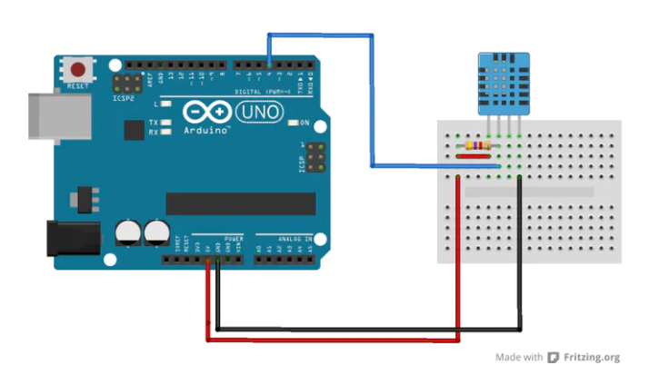
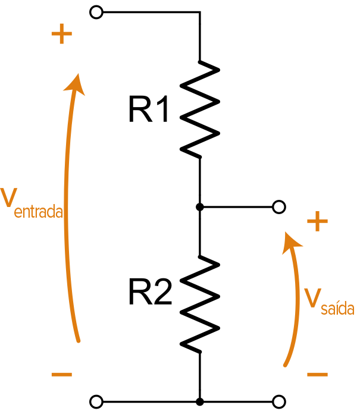
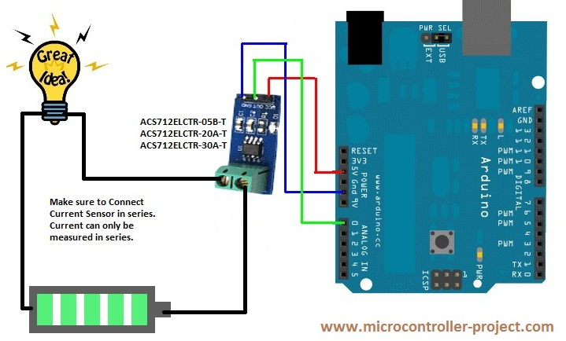

# TCC_tracker

## Pinos utilizados
- DHT11 = pino digital 4
- Sensor de tensão tracker = pino analogico A0 
- Sensor de tensão fixo = pino analogico A1
- Sensor de tensão motor = pino analogico A2
- Sensor de corrente tracker = pino analogico A3
- Sensor de corrente fixo = pino analogico A4
- Sensor de corrente motor = pino analogico A5
- Fim de curso 1 = pino digital 2
- Fim de curso 2 = pino digital 3
- RTC SDA = pino digital 5
- RTC SLC = pino digital 6
- Motor step = pino digital 7
- Motor dir = pino digital 8
## DHT11
---
- Foi utilizado a biblioteca dht11 para facilitar a leitura da umidade e temperatura;
- O sensor dht11 está sendo lido no pino **digital** 4;
- A leitura do sensor está dentro da função **readSensors()** que está sendo chamada dentro do loop;
### Esquemático


**NÃO COLOCAR RESISTOR** para o dht11 que só possui 3 terminais

## Sensor de Tensão
---
- Foi utilizado um divisor de tensão que permite ler uma tensão de até 60V;
- Para esse circuito foram utilizados um resistor de 220KΩ (R1) e um resistor de 20KΩ (R2);
- Os sensores de tensão estão conectados nas entradas:
    - A0: Tracker;
    - A1: Fixo;
    - A2: Motor;
- O valor da tensão é calculado pela função **readVoltage**
### Esquemático



## Sensor de corrente
---
- Foi utilizado o sensor ACS712-30A
- Os sensores de corrente estão conectados nas entradas:
    - A3: Tracker;
    - A4: Fixo;
    - A5: Motor;
- O valor da corrent é calculado pela função **readCurrentSensor**

### Esquemático


# Referências

- dht11: https://create.arduino.cc/projecthub/arcaegecengiz/using-dht11-b0f365

- Sensor de tensão: https://br-arduino.org/2015/06/voltimetro-com-arduino-como-montar-programar-e-calibrar.html

- Sensor de corrente: https://www.electronicshub.org/interfacing-acs712-current-sensor-with-arduino/

## Motor
- Será conectado aos pinos 7 e 8
- É preciso testar para ver quantos pulsos será preciso para cada angulo, Os valores dos pulsos deverão ser colocados nas váriaveis:
````
const int revolution15Degress = 100 // valores de exemplo
const int revolution20Degress = 150
const int revolution30Degress = 200
const int revolution50Degress = 300
````
